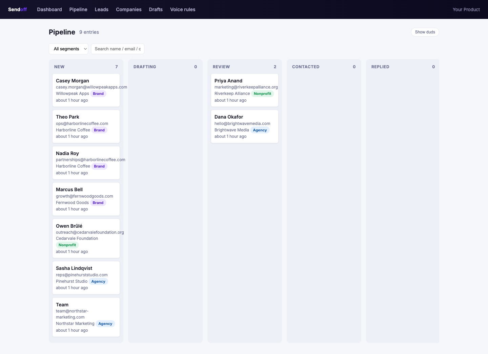
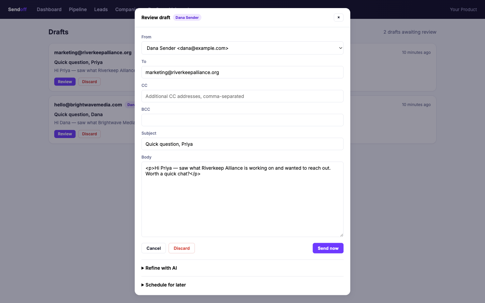
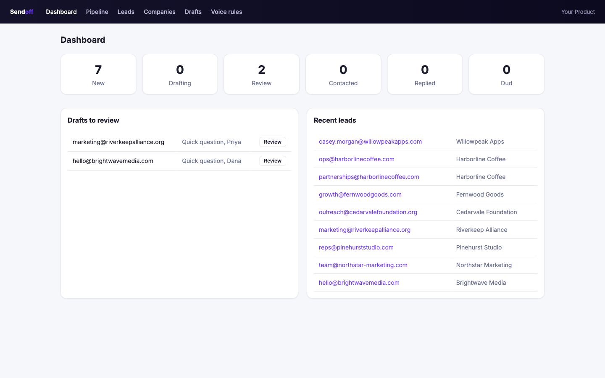
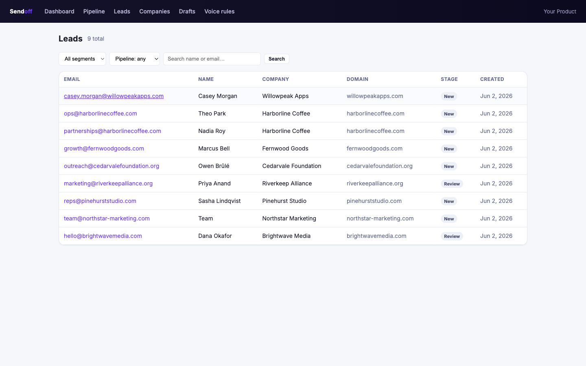

# Sendoff

**Self-hosted AI that handles your sales outreach for you.** Sendoff drafts emails in
your voice, checks them for hallucinations, holds to your sending rules, and sends them
via Gmail — driven by an LLM and steerable by an agent over MCP. Point it at where your
leads come from and it runs the outbound.

**It is not a CRM.** There's no inbox to tend and no records to maintain. Sendoff keeps
a lightweight pipeline internally so it knows who's been contacted and what to do next —
that's plumbing it hides, not a system you babysit.

MIT-licensed, ships as a mountable Rails engine. Everything domain-specific — where your
leads come from, who counts as an existing account, which LLM you call, and the voice you
write in — plugs in through a small set of adapters, a persona, and a pluggable LLM
client. The defaults are network-free, so the engine boots with zero configuration.

## Features

- **Pipeline state machine** — a six-stage funnel (`new → drafting → review → contacted → replied → dud`) with protected terminal stages.
- **LLM email drafter** — context assembly, prompt building from your persona, and a `Result` you can review or send.
- **Voice critic + hallucination critic** — a second LLM pass rewrites for voice and flags unsupported claims before anything goes out.
- **Send-safety guards** — daily/hourly caps and a per-recipient cooldown.
- **Gmail integration** — OAuth send + thread-history context.
- **MCP server** — drive the engine from an agent over the Model Context Protocol.
- **Admin UI** — a mountable Turbo + Stimulus interface: pipeline kanban (drag-drop), draft review/send/refine, lead & company browse, voice-rule management. Ships a small static CSS design system — no Tailwind build.
- **Lead enrichment** — an optional research adapter that reuses your LLM client to research a lead and write a summary (no extra services required).
- **Pluggable everything** — lead source, account lookup, brand-mention source, research, LLM client, and persona are all swappable.

## How it works

Sendoff separates *generic mechanics* (the funnel, drafter, critics, send-safety,
Gmail, MCP — all in the box) from *your domain* (leads, accounts, voice, LLM), which
you supply. The seam has three shapes:

- **Adapters** — small objects you implement to feed the engine data: `LeadSource`
  (where warm leads come from), `AccountLookup` (does this lead map to an existing
  account?), and `BrandMentionSource` (optional social-proof data).
- **Persona** — a value object describing *who* is writing, *in what voice*, to sell
  *what*. It replaces every hardcoded name, product string, voice rule, and URL.
- **LLM client** — any object responding to `#complete(prompt) -> String`.

You wire these up once via `Sendoff.configure`. Access the live config anywhere with
`Sendoff.config`. Every plug point has a network-free default:

| Config | Default | What it controls |
|--------|---------|------------------|
| `config.persona` | `Persona.default` | Sender name/email, product name + description, voice guide, outreach principles, allowed URLs, default CC/BCC, per-segment prompt hints. |
| `config.llm_client` | `LLM::ClaudeCliClient.new` | The LLM behind the drafter and critics. Any object with `#complete(prompt) -> String`. |
| `config.lead_source` | `Adapters::NullLeadSource.new` | Where warm leads are pulled from on sync. Returns `Array<LeadData>`. |
| `config.account_lookup` | `Adapters::NullAccountLookup.new` | Maps a lead to an existing account (`AccountInfo`) or `nil` for cold. |
| `config.brand_mention_source` | `Adapters::NullBrandMentionSource.new` | Optional social-proof counts/competitors used to justify a claim. |
| `config.gmail_client_for(account)` | real `Gmail::Client` | Per-account Gmail client. Swap for a fake in tests. |
| `config.hallucination_critic_enabled` | `true` | Run the fact-check pass before send. |
| `config.send_daily_cap` | `20` (`SENDOFF_SEND_DAILY_CAP`) | Max sends per day. |
| `config.send_hourly_cap` | `5` (`SENDOFF_SEND_HOURLY_CAP`) | Max sends per hour. |
| `config.recipient_cooldown_days` | `7` (`SENDOFF_RECIPIENT_COOLDOWN_DAYS`) | Don't re-contact the same recipient within this window. |
| `config.lead_fresh_touch_days` | `4` (`SENDOFF_LEAD_FRESH_TOUCH_DAYS`) | A lead touched within this window counts as "fresh". |

## Installation

Add the gem to your application's `Gemfile`:

```ruby
gem "sendoff"
```

Install, copy the engine's migrations into your app, and migrate:

```bash
bundle install
bin/rails sendoff:install:migrations
bin/rails db:migrate
```

The engine's tables are prefixed `sendoff_` and use UUID primary keys (via
`pgcrypto`), so they sit alongside your app's tables without collision. Mount the
engine in `config/routes.rb` if you want the MCP endpoint:

```ruby
mount Sendoff::Engine => "/sdr"
```

## Quick start

Configure the engine in an initializer. Set a `Persona`, pick the Claude CLI client,
and leave the adapters as their defaults (every lead is treated as a cold prospect
until you wire up a `LeadSource` and `AccountLookup`):

```ruby
# config/initializers/sendoff.rb
Sendoff.configure do |config|
  config.persona = Sendoff::Persona.new(
    product_name:        "Acme Analytics",
    product_description: "a reporting tool for agencies",
    sender_name:         "Dana Lee",
    sender_email:        "dana@acme.test",
    voice_guide:         Rails.root.join("config/voice_guide.md").read,
    outreach_principles: Rails.root.join("config/outreach_principles.md").read,
    allowed_url_patterns: [%r{\Ahttps://calendar\.acme\.test/}],
    default_cc:          ["founder@acme.test"]
  )

  config.llm_client = Sendoff::LLM::ClaudeCliClient.new
  # config.lead_source, config.account_lookup, config.brand_mention_source
  # keep their network-free defaults until you implement adapters.
end
```

Draft an email for a lead. `draft_for_lead` assembles context, builds the prompt from
your persona, runs the voice and hallucination critics, and returns a `Result`:

```ruby
lead   = Sendoff::Lead.find(id)
result = Sendoff::Drafter.draft_for_lead(lead, intent: :cold)

if result.skip_reason
  # The drafter declined to write (e.g. recently contacted, no usable context).
  Rails.logger.info("skipped: #{result.skip_reason}")
else
  result.subject    # => "Quick question about your Q3 reporting"
  result.body_html  # => "<p>Hi Dana — ...</p>"
end
```

`intent` is one of `:cold`, `:reengage`, `:checkin`, `:followup`, or `:auto`.

A copy-pasteable initializer with every option documented lives at
[`config/initializers/sendoff.rb.example`](config/initializers/sendoff.rb.example),
and the ENV vars the engine reads are listed in [`.env.example`](.env.example).

## Writing an adapter

Adapters are plain Ruby objects. Implement the one method each base class declares and
return the engine's normalized value objects.

### LeadSource — where warm leads come from

`#fetch` returns an `Array<Sendoff::Adapters::LeadData>`. The sync job upserts each
into a `Lead` (and its `Company` / `PipelineEntry`). `signals` is a free-form hash of
warmth indicators — nothing in the engine requires a particular key.

```ruby
class CrmLeadSource < Sendoff::Adapters::LeadSource
  def fetch
    Crm.recent_signups.map do |row|
      Sendoff::Adapters::LeadData.new(
        email:          row.email,
        full_name:      row.name,
        company_name:   row.company,
        company_domain: row.domain,
        segment:        row.segment,           # optional; classifier fills gaps
        signals:        { views: row.view_count, last_seen_at: row.seen_at }
      )
    end
  end
end

Sendoff.configure { |c| c.lead_source = CrmLeadSource.new }
```

### AccountLookup — is this lead already a customer?

`#find(lead)` returns an `AccountInfo` (existing account) or `nil` (cold prospect). The
drafter uses it to pick tone and to allow an account-specific URL. All `AccountInfo`
fields are optional.

```ruby
class CrmAccountLookup < Sendoff::Adapters::AccountLookup
  def find(lead)
    account = Crm.account_for(lead.email) or return nil

    Sendoff::Adapters::AccountInfo.new(
      subdomain:     account.subdomain,        # "acme" -> https://acme.example.com
      account_url:   account.url,
      plan_label:    account.plan_label,       # "$49/mo Pro"
      status:        account.status,           # "active" / "trialing" / "canceled"
      usage_label:   account.usage_summary,
      looks_dormant: account.dormant?,
      metadata:      { signup_source: account.source }
    )
  end
end

Sendoff.configure { |c| c.account_lookup = CrmAccountLookup.new }
```

A `BrandMentionSource` follows the same shape — implement `#count_for(company)` and
`#competitors_for(company)`. The default returns `0` / `[]`.

## Pluggable LLM

The drafter and both critics talk to `config.llm_client`. The only contract is one
method:

```ruby
def complete(prompt) # -> String
```

So you can back it with anything — a RubyLLM client, the `anthropic` gem, a local
model — by assigning any conforming object:

```ruby
class MyLlmClient
  def complete(prompt)
    MyProvider.chat(prompt) # returns a String
  end
end

Sendoff.configure { |c| c.llm_client = MyLlmClient.new }
```

The bundled `Sendoff::LLM::ClaudeCliClient` shells out to the `claude` CLI in
headless mode (binary resolved from the constructor arg, then `SENDOFF_CLAUDE_BIN`, then
`claude` on `PATH`).

For tests and demos, use `Sendoff::LLM::FakeClient` — a deterministic, network-free
client. It returns valid draft/critic JSON by default, accepts a scripted queue of
responses, or takes a handler proc:

```ruby
Sendoff::LLM::FakeClient.new                                  # sensible default JSON
Sendoff::LLM::FakeClient.new(responses: ["...", "..."])       # shifted per call
Sendoff::LLM::FakeClient.new { |prompt| build_response(prompt) }
```

The test suite swaps `FakeClient` in automatically (see Development).

## Development

The whole suite is network-free and needs no secrets — the test helper substitutes the
fake LLM and fake Gmail clients before each example.

```bash
bundle
bin/rails db:test:prepare
bundle exec rspec
```

### Try it end-to-end (no secrets)

A bundled, fully-fictional `Example::LeadSource` lets you watch the whole pipeline run
against a fake LLM — no API keys, no network:

```bash
cd spec/dummy && RAILS_ENV=development bin/rails db:schema:load && cd ../..
RAILS_ENV=development bundle exec rake app:sendoff:demo
```

It syncs example leads, classifies their segments, skips personal-email addresses, and
prints a pipeline summary.

## Admin UI

The engine mounts a Turbo + Stimulus admin interface at wherever you mount it
(e.g. `/sendoff`). Screens: a **Dashboard**, a **Pipeline** kanban with drag-drop
between stages, **Drafts** (review, edit, refine, schedule, send), **Leads** and
**Companies** browse + detail, and **Voice rules** management. Styling is a small
self-contained CSS design system — there's no Tailwind build step.

| Pipeline | Draft review |
|---|---|
|  |  |
| **Dashboard** | **Leads** |
|  |  |

To see it populated with fictional data, run the demo seed, then boot the dummy app:

```bash
cd spec/dummy && RAILS_ENV=development bin/rails db:schema:load && cd ../..
RAILS_ENV=development bundle exec rake app:sendoff:demo
cd spec/dummy && RAILS_ENV=development bin/rails server
# open http://localhost:3000/sendoff
```

Mount it in a host app behind your own auth (the base controller reads a
`Cf-Access-Authenticated-User-Email` header for the audit actor, falling back to
`"admin"`):

```ruby
# config/routes.rb
mount Sendoff::Engine => "/sendoff"
```

## Enrichment

`Sendoff::EnrichJob` researches a thin lead via `config.research_adapter` and
writes a summary `Note`. The bundled `Sendoff::Adapters::LLMResearch` reuses your
configured `llm_client` — no Firecrawl, MCP, or extra services. The default is
`NullResearch` (a no-op), so enrichment is strictly opt-in:

```ruby
config.research_adapter = Sendoff::Adapters::LLMResearch.new
```

## Drive it from an agent (MCP + the `/sdr` skill)

Sendoff ships an **MCP server** at `<mount>/mcp` exposing the whole workflow as
tools (`pipeline_summary`, `get_lead_context`, `queue_draft`, `refine_draft`,
`send_draft`, `move_to_stage`, `add_voice_rule`, …). This is the primary way to
operate it: an agent reads the pipeline, drafts in your voice, reviews for
hallucinations, and sends — while you watch.

Auth is a single header, `X-API-KEY`, checked against `ENV["SENDOFF_MCP_API_KEY"]`
(fail-closed — no key set means every request is `401`). Connect it to Claude:

```bash
claude mcp add sendoff --transport http \
  --url https://YOUR-HOST/sendoff/mcp \
  --header "X-API-KEY: $SENDOFF_MCP_API_KEY"
```

The repo includes a **`/sdr` Claude skill** (`.claude/skills/sdr/SKILL.md`) that
drives these tools end-to-end — "run my outreach" and it triages the pipeline,
drafts, reviews, and sends, then reports back. Copy it into your own
`.claude/skills/` to use it anywhere.

## Receiving replies & BCC copies

`POST <mount>/inbound_emails` is a provider-agnostic webhook that records inbound
replies and BCC'd copies of sent mail as `EmailEvent`s (matched to the lead and
thread, deduped by `Message-ID`). It accepts raw RFC822 or pre-parsed fields and
needs no ActionMailbox/ActiveStorage. Auth is `ENV["SENDOFF_INBOUND_SECRET"]`
(fail-closed). See [docs/inbound_email.md](docs/inbound_email.md) for the
**Cloudflare Email Worker**, SendGrid Inbound Parse, and Mailgun setups.

## Roadmap

The core is built (drafter, critics, send-safety, pipeline, Gmail, MCP, admin UI,
enrichment, inbound ingress). Natural next steps: a richer reply-handling inbox,
and pluggable LLM clients beyond the Claude CLI.

## License

Sendoff is available as open source under the terms of the
[MIT License](https://opensource.org/licenses/MIT).
